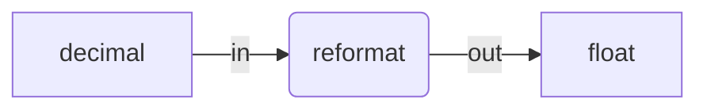
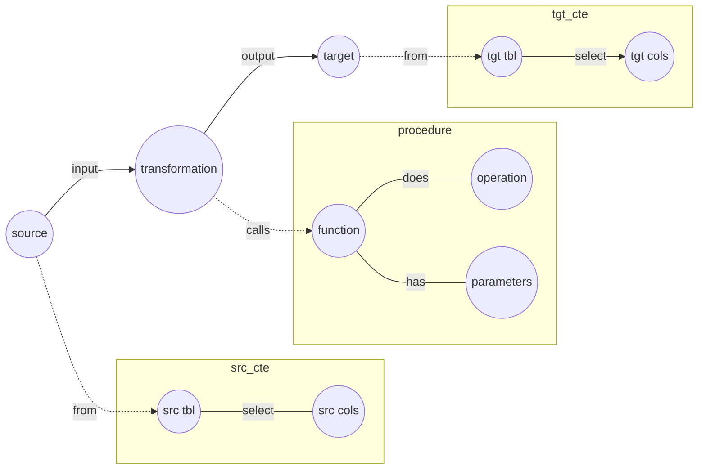

Aide Memoire 

Column Transformations for data storage in MS SQL Server 
====================================================== 

It is useful to perform transformations that enable us to store data in several generic formats. 

If we think of the tool in which the information is going to be displayed, it is probably only going to handle a number of key data formats. 

Take the [Power BI data formats](https://learn.microsoft.com/en-us/power-bi/connect-data/desktop-data-types) for example: 
- float 
- money (fixed) 
- whole 
- text 
- date/time 
- boolean 

If you can remember back to the [MS Access data types](https://support.microsoft.com/en-us/office/data-types-for-access-desktop-databases-df2b83ba-cef6-436d-b679-3418f622e482), we had: 
- short text 
- long text 
- number 
- currency 
- boolean 


It is also useful to distinguish how to store data (in a few limited formats) from how to calculate it. 
Take decimal numbers, for example. It is handy to store them as floats, but for the sake of accuracy we probably need to avoid floating point calculations by converting them to something like numeric(19,4) before performing a calculation in the database. 

We can break down the exercise into two general categories of transformation: **copy** like for like from one place to another, or **reformat** from a format in one place to a new format in another place.  

## Copy transformation: 
Information from one table column is copied to a different table column. 

Copy transformation data flow diagram: 


Copy transformation example code:  

```tsql 

/*** copy transformation example ***/ 

SELECT 
"string2string" = i.in_string     /* out_string */ 
FROM [source_input] as i 
; 
 

``` 

## Reformat transformation: 
Information in one data format is changed to a different data format. 

Reformat data flow diagram: 




Reformat example code: 

```tsql 

/*** reformat transformation example ***/ 

SELECT 

    "string2shorts" = TRY_CONVERT( nvarchar(255), i.[in_string_txt] ) /* out_short_txt */ 
    ,"string2longs" = TRY_CONVERT( nvarchar(8000), i.[in_string_txt] ) /* out_long_txt */ 
    ,"string2blobs" = TRY_CONVERT( nvarchar(max), i.[in_string_txt] ) /* out_blob_txt */ 
    ,"decimal2wholen" = TRY_CONVERT( int, i.[in_decimal_num] ) /* out_whole_num */ 
    ,"decimal2floatn" = TRY_CONVERT( float, i.[in_decimal_num] ) /* out_float_num */ 
    ,"date2dated" = TRY_CONVERT( datetime2(7), i.in_datetime_ymd ) /* out_datestamp */ 
    ,"time2timed" = TRY_CONVERT( time(7), i.[in_time_hms] ) /* out_timed */  

FROM [source_input] as i 
; 

``` 


### Primary Transformations 

Scope: column  

Some transformations occur at the column level: 
- duplicate  
- reformat   

Some column-level transformations tag the output name to indicate its usage: 
- key 
- code 


| code | value | class | description | 
| ---- | ----- | ----- | ----------- | 
| copy | NULL | duplicate | preserves original format | 
| string2code | varchar(50) | reformat | Tags the column name for lookups with 'code' | 
| string2blobs | nvarchar(max) | reformat | converts to blob string | 
| string2longs | nvarchar(4000) | reformat | converts to long string | 
| string2shorts | nvarchar(255) | reformat | converts to short string | 
| number2key | int | duplicate | Tags the column name for joining to a dimension with 'key' | 
| number2bign | bigint | reformat | converts to large number | 
| number2wholen | int | reformat | converts to whole number | 
| number2floatn | float | reformat | converts to floating point number | 
| number2shorts | varchar(50) | reformat | converts non-additive numbers to short string | 
| float2shorts | varchar(50) | reformat | converts non-additive floating point numbers to short string |
| date2dated | datetime2(7) | reformat | converts to datestamp | 
| time2timed | time(7) | reformat | converts to timestamp | 
 

### Column Classification 

Subsequent working with column data will be more efficient if the columns are classified: 

| Classification | Description | 
| -------------- | ----------- | 
| key | whole number used in dimensions or lookups | 
| code | string used in dimensions or lookups | 
| metadata | date time or string information about a record | 
| id | record identifier that is not used in dimensions or lookups |  


### Secondary Transformations 

Some secondary transformations can now be considered, based on the data type and classification: 

| code | value | class | description | 
| ---- | ----- | ----- | ----------- | 
| stringd2numberd | date | reformat | date number stored as string converted to number | 
| numberd2dated | date | reformat | date number converted to date | 
| numberr2dated | date | reformat | relative date number converted to date | 

Note: Relational databases often do not store dates as dates, but as numbers (keys) - e.g. 20221102 for 2022-11-02 - or as relative date numbers - e.g. unix dates are the number of days since 1950, excel dates are the number of days since 1901. 

## Metadata-driven development 

Many databases use repeating codes for table and column names, enabling metadata-driven development from a data dictionary. 

Take the "ABAN8" Address Number column in the "F0101" Address Book table, of the [JD Edwards ERP](https://jde.erpref.com/?schema=920&table=F0101) for example. The prefix for all the columns in the Address Book is "AB". "AN8" is the code for Address Number, and appears in [over 1,000 table columns across all the JDE modules](https://jde.erpref.com/?schema=920&column=AN8).  

If we build a dictionary of transformations by column code, we can then leverage that logic over 1000 times: 

| column code | column descriptive name | source format | target format | transform pattern | 
| ----------- | ----------------------- | ------------- | ------------- | ----------------- | 
| AN8 | Address Number | numeric(8,0) | int | SELECT CAST( @input_column_name as int ) AS @output_column_name WHERE RIGHT(@input_column_name, 3) = 'AN8' | 


# Transformation graph 

We can conceptualise transformations in graph format: 



QED 

