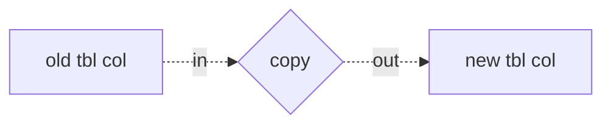

Aide Memoire 

How to Perform Column Transformations in MS SQL Server 
====================================================== 

Transformation scope: column level 

Some transformations occur at the column level: 
- copy: data from one table column is copied to a different table column. 

