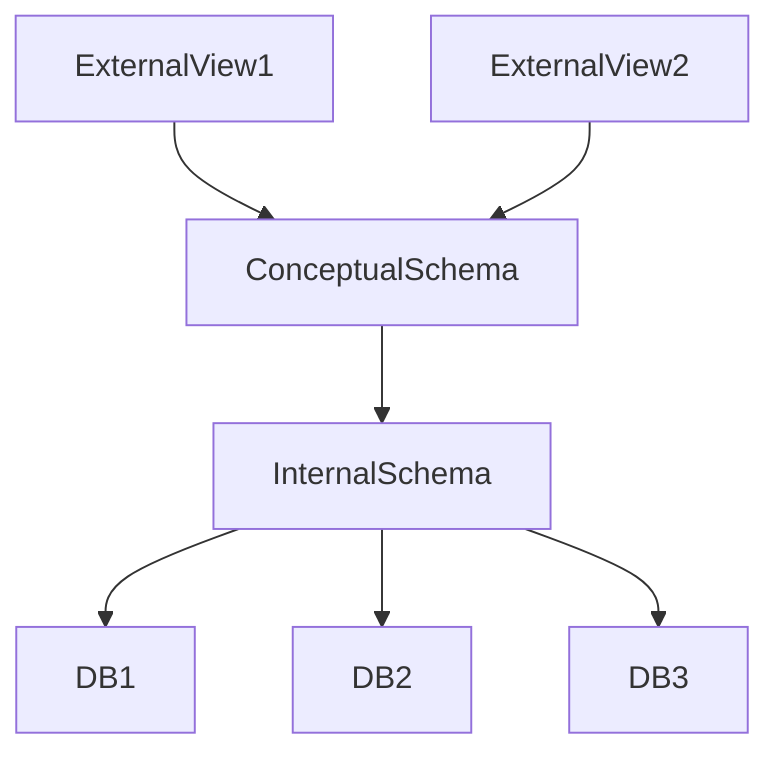

AIDE MEMOIRE

# Introduction to Databases

Databases are used to manage large collections of data:  

- Entities: physical objects, people, events
- Attributes: characteristics of entities
- Data: collect data for attributes
- Record: The set of values for one entity

## Three-schema Architecture

- Internal: physical storaage structure
- Conceptual: Entities, attributes, constraints 
- External: End-user views

# DBMS

A Database Management System (DBMS) supports the creation and maintenance of a database.

A database system consists of a database and software.

Database software consists of the DBMS and applications. 

## DBMS Roles

- DBA: Database administrators
- Database designers
- End users

## DBMS Languages

_If a DMBS does not separate the levels, DDL may be the only language used._
- SDL: Storage Definition Language (specifies the internal schema)
- DDL: Data Definition Language (may specify both conceptual and external schemas)
- VDL: View Definition Language (specifies external schema)
- DML: Data Manipulation Language

## Data Models

A data model describes the structure of a database: 
- Intension: The schema describes the database
- Instance: The actual data stored at a point in time
- Extension: The state of the database

Schemas change rarely while state changes constantly with every commit. 

### Components

Data models have three levels of component: 
- Structural Component: Basic building blocks
- Integrity Component: Constraints
- Operational Component: Insert, update, delete operations

QED 

© Adam Heinz 

4 November 2024